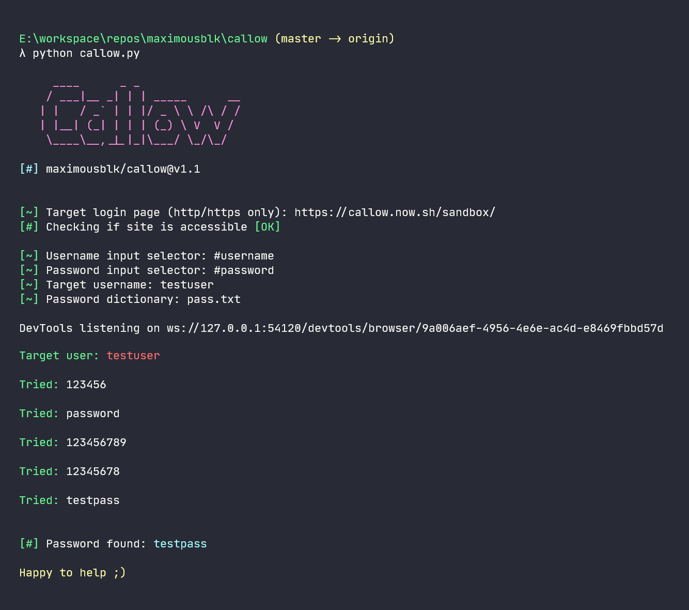

Callow - An Amazing Project

# Callow

[](https://callow.now.sh/)

Callow makes it stupidly simple to brute-force website login pages. It has been made with beginners in mind and is super intuitive.

## Requirements

1. Python 3.5+
2. Google chrome
3. [ChromeDriver](https://chromedriver.chromium.org/)

**Note:** Use the ChromeDriver version corresponding to your Chrome version.

## Installation

- Clone the repo or download from [releases](https://github.com/maximousblk/callow/releases):

```txt
git clone github.com/maximousblk/callow.git
```

Repo is more frequently updated and fixes are easy to apply. Releases may not be completely up to date but more stable.

- Install dependencies:

```txt
pip3 install -r requirements.txt
```

## Updating

If you want to get most recent updates for Callow, just pull the repository using

```txt
git pull origin master
```

Or, you can download the latest version from [releases page](https://github.com/maximousblk/callow/releases) on Github.

## Quick Start

If you are doing this first time, you can test this safely on our [sandbox](https://callow.now.sh/sandbox/) so that no one gets harmed

Most important part for this to work is to get the selectors right.

1. Run `callow.py` in the installation directory
2. Enter the URL for the login
3. Go to the login page
4. Open developer tools using `Ctrl` + `Shift` + `I`
5. Enter the css selector for `<input>` tags for username and password field
6. Enter the username or email of the target
7. Enter the location of the password dictionary/list and hit Enter



Check out the [medium post](https://medium.com/@maximousblk/callow-6d42a14dbd50/) if you want a more elaborate guide.

## Arguments

You can also pass those options in the form of arguments.

You can see the options for Callow here.

| Option   | Function                         |
| -------- | -------------------------------- |
| `--site` | Target website (http/https only) |
| `--usel` | Username input selector          |
| `--psel` | Password input selector          |
| `--user` | Target username to attack        |
| `--pass` | Password dictionary              |

Here is an example of how to use the arguments:


## To Do

- [X] Port to Python 3.x
- [X] Cross platform compatibility
- [ ] Proxy/Tor support

For more, look into [issues](/issues/) and [projects](/projects/)...

## Disclaimer

> This project (Callow) and it's contributors do not support or take responsibility for any form of unethical acts. This software is purely for educational purposes and is not intended to cause any harm.

## License

Callow is a fork of [metachar/Hatch](https://github.com/metachar/Hatch) but I wanted to develop it independently. Being a fork of a parent project, Callow respects and inherits the same license terms of Hatch.

Callow is available free of charge under the [GPL-3.0 license](https://www.gnu.org/licenses/gpl-3.0.en.html) and can be used for both, commercial and non-commercial purposes.
